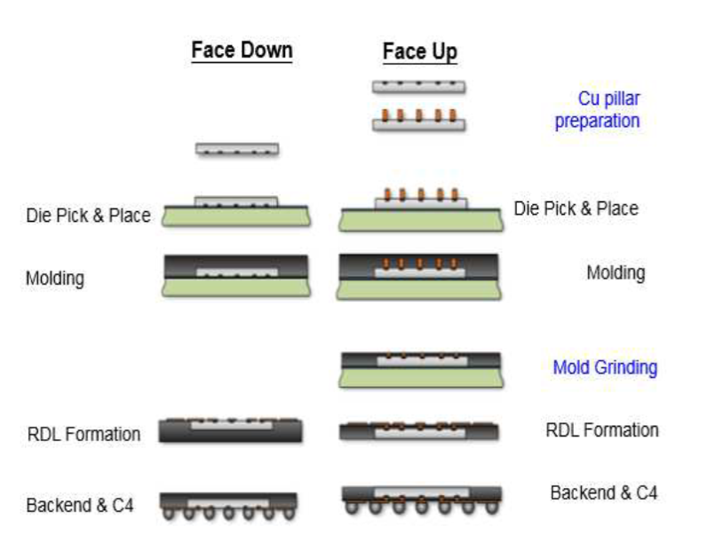

## 3. 晶圆/面板级封装 WLP/PLP

### 3.1 Fan-in WLP

Fan-in WLP 在原始晶圆上完成钝化层、RDL、UBM 和焊球。

所有的重布线层（RDL）和锡球（Bumps）都排布在芯片原本的尺寸范围内。

封装后的芯片尺寸和裸芯片（Die）几乎完全一样，因此它属于典型的WLCSP（晶圆级芯片尺寸封装）。

相比于Flip-Chip，它省去独立封装基板，封装尺寸接近裸片，适合尺寸较小、I/O 数量有限的器件。

### 3.2 Fan-out WLP

当芯片太小、管脚太多时，Fan-in装不下了。于是，工程师先将芯片切成单颗，再像拼图一样，把芯片重新组装到一个更大的临时基板上，用环氧树脂（EMC）灌封，形成重构晶圆。

这样，芯片四周就多出了一圈“人造空地”，重布线层可以延伸（扇出）到芯片外部。

WLP 使用圆形晶圆设备，工艺生态成熟；PLP 提高面积利用率和潜在产能，但对大尺寸面板的翘曲、设备兼容性和工艺均匀性要求更高。

### 3.3 Chip-first 与 Chip-last

Chip-first 先放置芯片并重构载体，再在芯片焊盘和 EMC 上直接制作 RDL，互连路径短且通常没有独立微凸点界面，但已知良品芯片（KGD）可能经历全部 RDL 制程，且 die shift 会直接消耗光刻对位裕量。

Chip-last 又称 RDL-first，先制作并可测试 RDL 载体，再贴装芯片。它有利于筛除不良 RDL、保护芯片免受前段制程影响，但增加微凸点/键合界面，并要求控制贴装共面性和底填。

> 注：KGD经历的后续工艺越少，最终良率才会越高。

### 4.1 Face-up 与 Face-down

face-down / face-up 是**对 Chip-First 的进一步细分**。

这里的 face 指的是 die active 面，也就是后续要和 RDL 连接的那一面。

**face-up 比 face-down 多了两个关键步骤：**

**1. Cu pillar preparation**
**2. mold grinding**

在 face-down 中，RDL via 要直接落到 die pad 上。先进制程下 die pad pitch 越来越小，pad 尺寸也更小，塑封等流程造成的 die shift 很容易让 RDL via 偏离 pad。

Face-up 的改进点是先做 **Cu pillar**。Cu pillar 可以比原始 die pad 做得更大，把原来很难直接对准的 die pad 转化成一个更容易被 RDL 接到的三维金属接触点。
